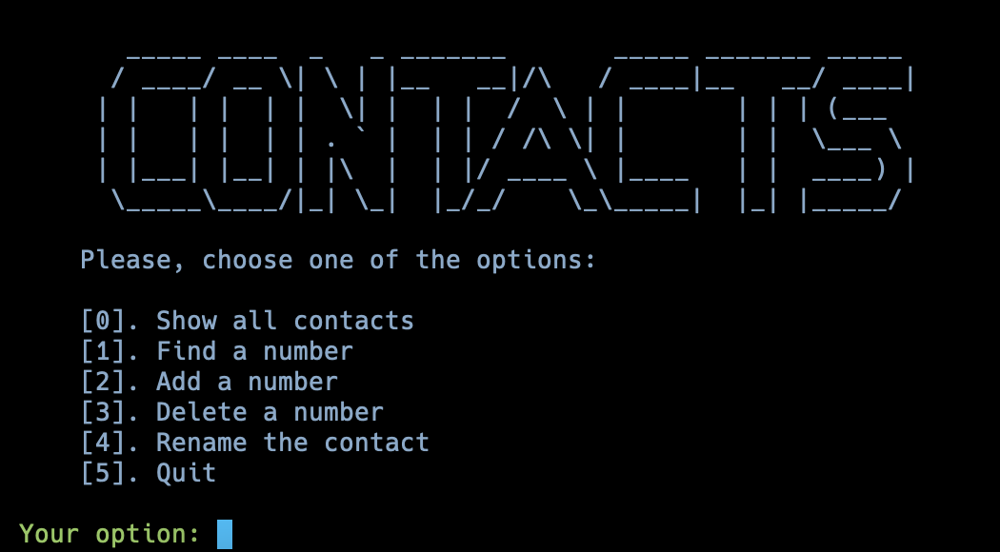

<b>Contact Manager</b>
  
This Python code is a simple contact manager with various features:
<ul>
    <li><b>Show all contacts [0]:</b> Display all contacts.</li>
    <li><b>Find a number [1]:</b> Search for a contact by name.</li>
    <li><b>Add a number [2]:</b> Add a new contact with a name and phone number.</li>
    <li><b>Delete a number [3]:</b> Remove a contact by name.</li>
    <li><b>Rename the contact [4]:</b> Change a contact's name.</li>
    <li><b>Quit [5]:</b> Save and exit.</li>
</ul>

<b>Usage:</b>
<ol>
    <li>Install required dependencies:</li>
</ol>
<code>pip install -r requirements.txt </code>

<ol start="2">
    <li>Run the program: </li>
</ol>
<code>python main.py</code>

<b>Features:</b>
<ul>
    <li>Uses Colorama for colored output.</li>
    <li>Data storage with pickle.</li>
</ul>

<b>Screenshots:</b>

<b>Author:</b> Nik1t7n

<b>License:</b> MIT License
